<p align="center">
  
</p>

# WriteBookWhale (写书鲸)

English | [中文](README.md)

### Keep your ideas, manuscript, and Agent inside the same book.

WriteBookWhale is an AI writing desk built for long-form fiction. Write chapters, shape outlines, inspect chapter plans, or select a passage and ask the Agent to continue it, revise it, or challenge it.

You do not have to paste the whole novel into chat again and again. The Agent follows the book, chapter, and selection you are looking at, and every edit returns to its original place as a proposal you can review before it becomes part of the manuscript.


## WriteBookWhale in one picture

WriteBookWhale is not a separate AI editor bolted onto DSH. It composes with native DSH Agents, Presets, Skills, and Subagents, while novel assets, explicit references, and revision proposals keep the writer and the Agent inside the same book.

```mermaid
flowchart LR
  Writer["Writer<br/>Draft · Select · Review · Finalize"]
  Workbench["WriteBookWhale<br/>Library · Manuscript · Outline · Chapter Plan"]
  Context["Writing Context<br/>Active Asset · Selection · Story State"]
  Agent["DSH Agent<br/>Preset · Skills · Subagent"]
  Tools["Novel Tools<br/>Locate · Read · Search · Propose"]
  Assets["Novel Assets<br/>Manuscript · Outline · Style · Review"]
  Safety["Safe Changes<br/>ChangeSet · Diff · Revision"]
  Files["Local Novel Project<br/>Markdown · YAML · .novel"]

  Writer -->|writes and selects| Workbench
  Workbench -->|shares the active view| Context
  Context -->|supplies task-sized material| Agent
  Agent -->|calls| Tools
  Tools -->|reads or proposes changes to| Assets
  Assets -->|enters review through| Safety
  Safety -->|updates after approval| Workbench
  Safety -->|stores content and history in| Files
```




## Open the desk and know what comes next

The home screen brings your books, word count, and recent progress together. Continue from the last chapter or open any novel; the conversation and writing desk move to that project without making you explain its background again.

## The WriteBookWhale writing desk


## NOAI scan and rigorous review


## Reading experience and working modes


## Keep the chapter plan beside the manuscript

The chapter plan is a scratch space permanently bound to its chapter. Capture an emotional target, a key image, a four-beat progression, or an ending hook—or ignore every template and write freely. Open it when the scene stalls and fold it away when the prose is moving.

## Let the Agent experiment while you keep final say

The Agent cannot silently overwrite the manuscript. It creates a reviewable ChangeSet that you may accept, reject, or edit further, and previous revisions remain recoverable. Only a revision you explicitly mark as final becomes eligible for writing-preference learning.

That makes it safe to try a sharper opening, a stronger conflict, or a different rhythm without losing the lines that already work.

## A writing partner that is willing to be critical

Run a strict chapter review or a fast NOAI scan when you decide the draft is ready. The reviewer challenges logic, pacing, character behavior, immersion breaks, and unnatural expression. NOAI uses local rules to flag common mechanical patterns and binds its findings to the exact manuscript revision it scanned. Both diagnose; neither silently rewrites the page.

## Who it is for

- Serial-fiction writers who want an Agent to remember earlier chapters, plans, and the book's rhythm.
- DSH users who have outgrown managing a novel as chat history plus scattered files.
- Writers who want AI help with drafting, revision, and critique while keeping every change visible, optional, and recoverable.
- Authors who want their books to stay on their own computer in portable Markdown and YAML files.

## What is already here

- A library home, cross-project continuation, and daily word-count summary.
- Manuscript chapters, book and volume outlines, chapter plans, book brief, style profile, and Story State.
- Active-asset and text-selection references, dedicated Novel Tools, ChangeSets, and Revisions.
- Chapter creation, renaming, deletion, drag sorting, autosave, finalization, and revision restore.
- Chapter execution, scene-action choices, style revision, strict review, NOAI diagnostics, and preference extraction.
- A dedicated DSH Agent Preset, Skills, and review Subagent, all composed through native DSH extension points.

## Install

WriteBookWhale currently targets the DeepSeek Harness `0.1.2-alpha.2` release family and follows DSH prereleases closely. Install a tagged release and check the [compatibility matrix](COMPATIBILITY.md) before upgrading DSH.

```sh
dsh plugin --profile web add \
  github:shuaweng/DSH_xieshujing#v0.1.2-alpha.11
dsh --profile web
```

After DSH starts, choose the Novel Workbench Agent Preset and click the WriteBookWhale icon inside the composer. Installation does not replace the existing default Preset or change other Profiles.

<details>
<summary>Requirements, upgrades, and removal</summary>

Requirements: Node.js `^22.19.0 || >=24.0.0`, DeepSeek Harness release family `0.1.2-alpha.2`, and a working DSH Web Profile.

Upgrade by running `add` again with the new release tag. Remove the plugin with:

```sh
dsh plugin --profile web remove @xieshujing/dsh-plugin
```

Removal deletes only the plugin. Your `novel.yaml`, manuscript, planning files, and `.novel/` history remain in their original directory.

</details>

## Your book remains yours

Novel content stays in the local directory you choose. The default Novel Preset does not expose a general shell or arbitrary file-writing tools to the Agent; authored assets move through dedicated Novel Tools, Revisions, and reviewable ChangeSets.

For help, open a [GitHub Issue](https://github.com/shuaweng/DSH_xieshujing/issues) with reproduction steps and the DSH and WriteBookWhale versions. Follow [SECURITY.md](SECURITY.md) for vulnerability reports.

## License

[MIT](LICENSE). WriteBookWhale is built on MIT-licensed DeepSeek Harness; see [NOTICE.md](NOTICE.md).
