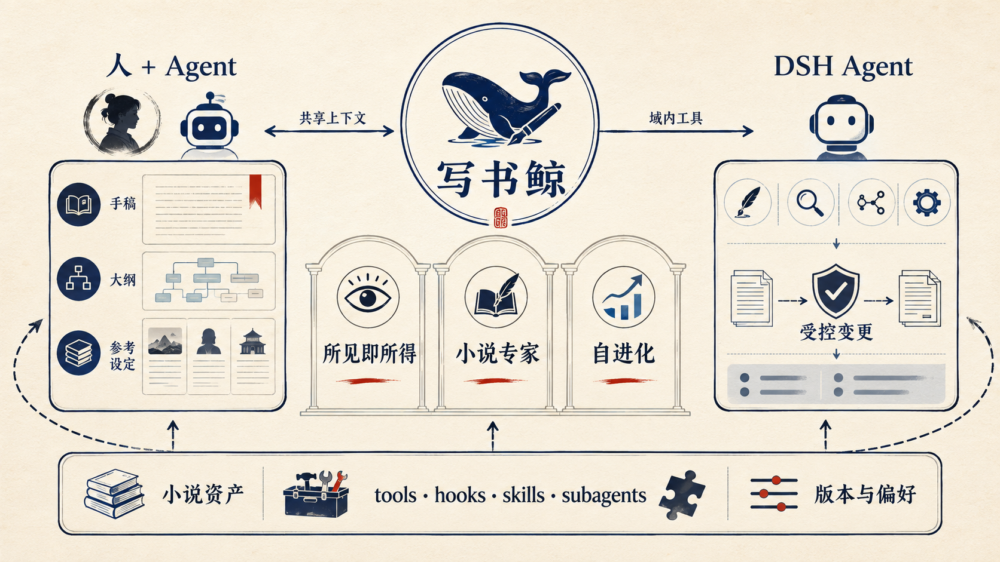
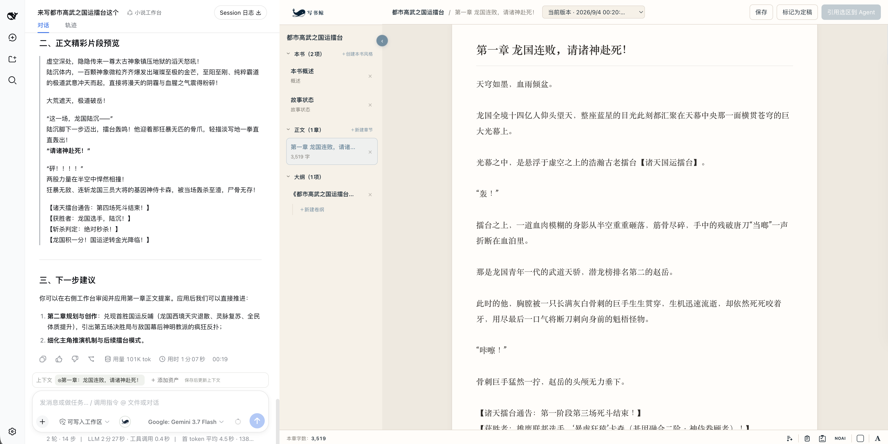
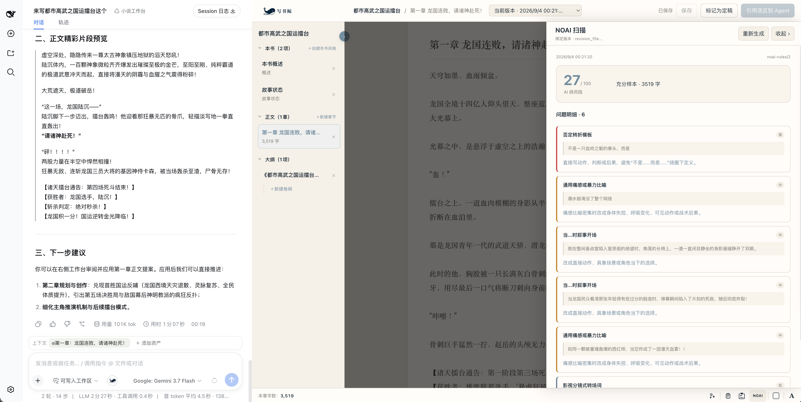
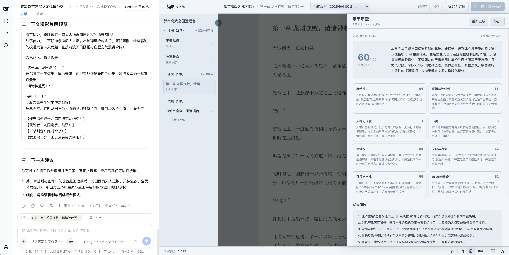
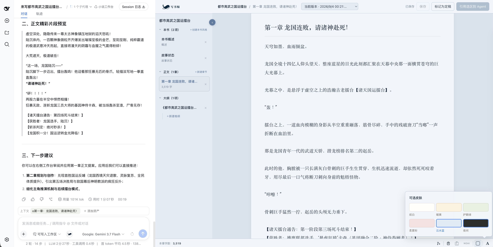
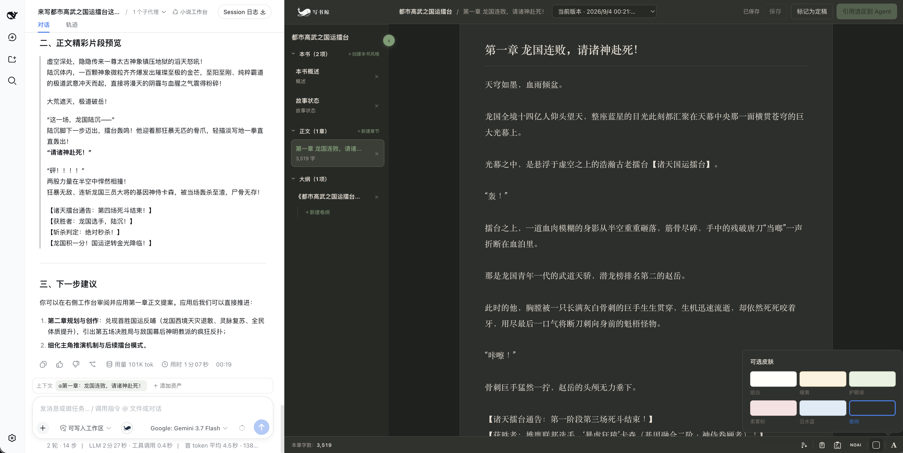
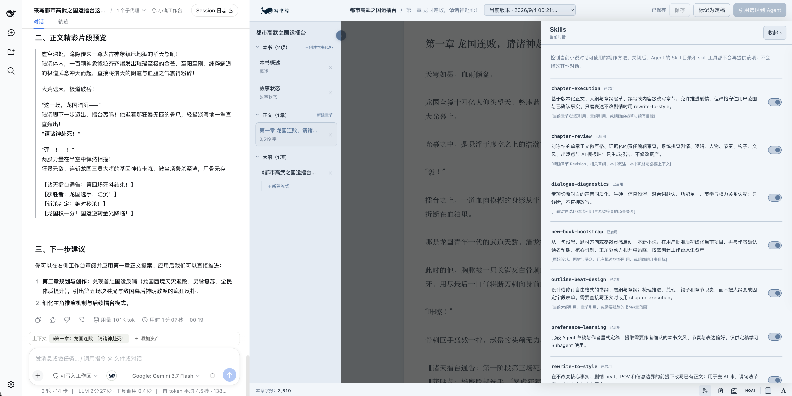

<p align="center">
  
</p>

# 写书鲸

[English](README.en.md)

### 让灵感、正文与 Agent，真正写在同一本书里。

写书鲸是一张为长篇创作准备的 AI 写作桌。你可以像往常一样写正文、理大纲、看章纲，也可以随手圈选一段，让 Agent 接着写、改一版或认真挑错。

它不要求你把整本书反复复制进聊天框。Agent 会跟随你正在看的书、章节和选区，所有修改先作为建议回到原位置，由你决定是否落稿。


## 一张图看懂写书鲸

写书鲸不是另一套孤立的 AI 写作工具。它把小说工作台接入 DSH 原生的 Agent、Preset、Skills 与 Subagent，同时用小说资产、明确引用和版本提案，保证人和 Agent 始终在编辑同一本书。




## 打开就知道下一步写什么

首页把书、字数与最近进度放在一起。你可以从上次停下的章节继续，也可以打开任意一本小说；对话与写作台同步切换到对应项目，不必重新解释背景。

## 写书鲸的写作现场




## NOAI 扫描与严格审查





## 阅读体验与工作方式







## 章纲贴着正文，卡文时不用来回翻

章纲作为单章的随手工作区，始终绑定当前章节。可以记情绪目标、场面钥匙、起承转合或章末钩子，也可以保持完全自由；写正文时随时展开，写顺了就收起。

## Agent 可以大胆提案，你始终握着定稿权

Agent 不会绕过工作台偷偷覆盖正文。它创建可查看差异的修改提案；你可以接受、拒绝、继续修改，也可以从历史版本恢复。只有主动“标记为定稿”的版本，才会进入写作偏好学习流程。

这意味着你可以放心让 Agent 尝试更激进的开头、更强的冲突或另一种节奏，而不用担心好句子被一次覆盖抹掉。

## 不只帮你写，也认真帮你挑刺

章节完成后，可以主动运行严格审查或 NOAI 扫描。审查 Agent 会从逻辑、节奏、人物行为、读者出戏感与表达自然度等角度挑刺；NOAI 则用本地规则快速标出高频机械句式，并把问题绑定到当前正文版本。两者都只给诊断，不会趁你不注意重写正文。

## 谁会喜欢写书鲸

- 正在连载长篇网文，希望 Agent 记得前文、章纲和本书节奏的作者。
- 已经在 DSH 中写作，但不想继续用“聊天记录 + 一堆散落文件”管理小说的人。
- 想让 AI 参与续写、改写和审稿，又坚持所有改动都可见、可选、可恢复的人。
- 希望小说仍保存在自己电脑里，并能继续用 Markdown、YAML 和 Git 管理的人。

## 目前已经具备

- 小说书库首页、跨项目继续创作与今日字数统计。
- 正文、全书大纲、卷纲、章纲、本书概述、本书风格与 Story State。
- 当前资产与划词引用、专属 Novel Tools、ChangeSet 和 Revision。
- 章节新建、改名、删除、拖动排序、自动保存、定稿与历史恢复。
- 章节执行、场景行动选择、文风改写、严格审稿、NOAI 扫描与偏好提取。
- 写书鲸专属 Agent Preset、Skills 与审查 Subagent，全部运行在 DSH 原生体系内。

## 安装

写书鲸目前适配 DeepSeek Harness `0.1.2-alpha.2` 版本家族，并跟随 DSH 预发布版本迭代。建议使用版本标签安装，并在升级 DSH 前查看[兼容矩阵](COMPATIBILITY.md)。

```sh
dsh plugin --profile web add \
  github:shuaweng/DSH_xieshujing#v0.1.2-alpha.11
dsh --profile web
```

启动后，在 Agent Preset 中选择“小说工作台”，再点击输入框中的写书鲸图标。安装不会替换原有默认 Preset，也不会影响其他 Profile。

<details>
<summary>运行要求、升级与卸载</summary>

运行要求：Node.js `^22.19.0 || >=24.0.0`、DeepSeek Harness `0.1.2-alpha.2` 版本家族，以及一个可正常启动的 DSH Web Profile。

升级时使用新的版本标签重新执行 `add`。卸载命令如下：

```sh
dsh plugin --profile web remove @xieshujing/dsh-plugin
```

卸载只移除插件本身。你的 `novel.yaml`、正文、策划文件与 `.novel/` 历史数据会继续留在原目录。

</details>

## 你的书，仍然属于你

小说内容保存在你选定的本地目录。写书鲸的默认 Novel Preset 不向 Agent 暴露通用 Shell 或任意文件写入能力；正式资产通过小说专属工具、版本和修改提案流转。

遇到问题，欢迎在 [GitHub Issues](https://github.com/shuaweng/DSH_xieshujing/issues) 提交复现步骤、DSH 版本与写书鲸版本。安全问题请遵循 [SECURITY.md](SECURITY.md)。

## 许可证

[MIT](LICENSE)。写书鲸基于 MIT 许可的 DeepSeek Harness 构建，详见 [NOTICE.md](NOTICE.md)。
